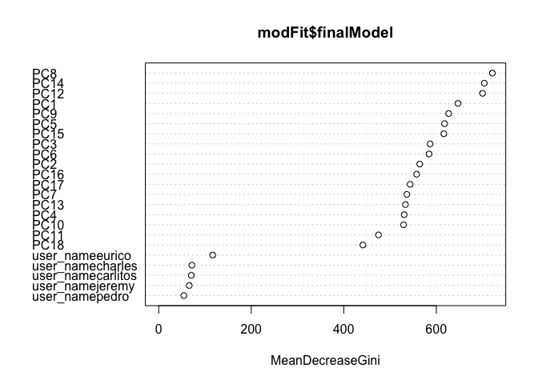

# Practical Machine Learning - Course Project
Jonathan Hines  
October 24, 2015  

# Introduction
The purpose of this study is to build a machine learning model based on the dataset found here:

[https://d396qusza40orc.cloudfront.net/predmachlearn/pml-training.csv](https://d396qusza40orc.cloudfront.net/predmachlearn/pml-training.csv)

Once a suitable model has been created, it should be checked against the following test data which does not have the class recorded:

[https://d396qusza40orc.cloudfront.net/predmachlearn/pml-testing.csv](https://d396qusza40orc.cloudfront.net/predmachlearn/pml-testing.csv)

This data a serries of measurements taken from 6 participants who did barbell lifts in a variety of different classes A through E.  Class A corresponds to correctly performing the exercise while the remaning classes are different types of errors that are common for that exercise.  The training dataset contains a column with the heading Classe which lists Class of a particular exercise.  Each row corresponds to a particular point in time and measurements recorded from accelerometers mounted on the barbell, belt and fore arm of a particular participant.  This data comes from the study described here:

[http://groupware.les.inf.puc-rio.br/har](http://groupware.les.inf.puc-rio.br/har)

# Data Cleaning and Exploration

Reading in the data set provides two data frames:

```r
training <- read.csv("./pml-training.csv")
testing <- read.csv("./pml-testing.csv")
```

Review of the test and training data sets indicates that many of the columns in the training and test set are empty or marked N/A.  Since we will need to validate against the test set and some all populated columns of the test set are found in the training set, all columns not found in the test set are removed from both of the data sets.  In addition, the training set is taken over windows in time.  Since the test set consists of only 20 lines which are unique entries in time, it is not useful to build a model using time specific information.  The filered data sets are constructed by removing empty columns, results, indicies and time related information.  Results and problem id's are stored separately for later use.


```r
removed.columns <- c(
  "X",
  "raw_timestamp_part_1",
  "raw_timestamp_part_2",
  "cvtd_timestamp",
  "new_window",
  "num_window",
  "classe",
  "problem_id"
)
training.filtered <- training[,colSums(is.na(testing))==0 & !( names(training) %in% removed.columns )]
training.classe <- training$classe

testing.filtered <- testing[,colSums(is.na(testing))==0 & !( names(testing) %in% removed.columns )]
testing.problem_id <- testing$problem_id
dim(training.filtered)
```

```
## [1] 19622    53
```

```r
dim(testing.filtered)
```

```
## [1] 20 53
```

```r
names(training.filtered)
```

```
##  [1] "user_name"            "roll_belt"            "pitch_belt"          
##  [4] "yaw_belt"             "total_accel_belt"     "gyros_belt_x"        
##  [7] "gyros_belt_y"         "gyros_belt_z"         "accel_belt_x"        
## [10] "accel_belt_y"         "accel_belt_z"         "magnet_belt_x"       
## [13] "magnet_belt_y"        "magnet_belt_z"        "roll_arm"            
## [16] "pitch_arm"            "yaw_arm"              "total_accel_arm"     
## [19] "gyros_arm_x"          "gyros_arm_y"          "gyros_arm_z"         
## [22] "accel_arm_x"          "accel_arm_y"          "accel_arm_z"         
## [25] "magnet_arm_x"         "magnet_arm_y"         "magnet_arm_z"        
## [28] "roll_dumbbell"        "pitch_dumbbell"       "yaw_dumbbell"        
## [31] "total_accel_dumbbell" "gyros_dumbbell_x"     "gyros_dumbbell_y"    
## [34] "gyros_dumbbell_z"     "accel_dumbbell_x"     "accel_dumbbell_y"    
## [37] "accel_dumbbell_z"     "magnet_dumbbell_x"    "magnet_dumbbell_y"   
## [40] "magnet_dumbbell_z"    "roll_forearm"         "pitch_forearm"       
## [43] "yaw_forearm"          "total_accel_forearm"  "gyros_forearm_x"     
## [46] "gyros_forearm_y"      "gyros_forearm_z"      "accel_forearm_x"     
## [49] "accel_forearm_y"      "accel_forearm_z"      "magnet_forearm_x"    
## [52] "magnet_forearm_y"     "magnet_forearm_z"
```

In order to provide cross validation the training dataset was split into a two sets a working training set and a working testing set.  The data was split randomly with 0.75% in the training set.


```r
library(caret)
set.seed(2132)
inTrain = createDataPartition(training.classe, p = 3/4)[[1]]
work.training = training.filtered[ inTrain,]
work.testing = training.filtered[-inTrain,]
work.classe.training <- training.classe[inTrain]
work.classe.testing <- training.classe[-inTrain]
```

The user name of the participant is present in both the training and test data sets.  It is unclear whether or not this is useful information as shown here, actual values recorded seem heavily dependent on user but when plotted by user, the class doesn't separate out into clusters as one might hope.


```r
ggplot(data=training.filtered,
  aes(x=training.classe,y=magnet_belt_y,colour=user_name,fill=user_name)) +
  geom_dotplot(binaxis="y"
    ,binwidth=diff(range(training.filtered$magnet_belt_y))/500,
    ,stackdir="center")
```

 

It may make sense to normalize on user for live studies but as shown below this was not necessary in this study.

# Machine Learning Model Construction

This is a classification problem, so an algorithm that generates classification trees will work well here.  As the measurements recorded are various components of motion from the same sensors, it is very likely that the features are highly demendant.  To reduce the number of features, principal components were computed to account for 90% of the variance in the orignal data set features.


```r
preProc <- preProcess(work.training, method = "pca", thres = 0.9)
## Get PC training data
work.training.PC <- predict(preProc,work.training)
work.testing.PC <- predict(preProc,work.testing)
final.testing.PC <- predict(preProc,testing.filtered)
names(work.training.PC)
```

```
##  [1] "user_name" "PC1"       "PC2"       "PC3"       "PC4"      
##  [6] "PC5"       "PC6"       "PC7"       "PC8"       "PC9"      
## [11] "PC10"      "PC11"      "PC12"      "PC13"      "PC14"     
## [16] "PC15"      "PC16"      "PC17"      "PC18"
```

Plotting the first and second primary components suggsets that the classes are starting to cluster although user is still very important to the actual values recorded as seen in the 5 clusters below.


```r
qplot(work.training.PC$PC1,work.training.PC$PC2,color=work.classe.training)
```

 


To determine an optimum classification tree the random forests algorithm was employed with all computed primary components and the user name included:


```r
modFit <- train(work.classe.training ~ .,method="rf",data=work.training.PC)
```

This model took over an hour to compute and was cached after the first time it was computed.


Here is the model and confusion matricies for the work taining and testing primary component datasets


```r
modFit
```

```
## Random Forest 
## 
## 14718 samples
##    18 predictor
##     5 classes: 'A', 'B', 'C', 'D', 'E' 
## 
## No pre-processing
## Resampling: Bootstrapped (25 reps) 
## Summary of sample sizes: 14718, 14718, 14718, 14718, 14718, 14718, ... 
## Resampling results across tuning parameters:
## 
##   mtry  Accuracy   Kappa      Accuracy SD  Kappa SD   
##    2    0.9543352  0.9421878  0.002496868  0.003156598
##   12    0.9525439  0.9399389  0.003269889  0.004127839
##   23    0.9395943  0.9235525  0.005075320  0.006395001
## 
## Accuracy was used to select the optimal model using  the largest value.
## The final value used for the model was mtry = 2.
```

```r
confusionMatrix(work.classe.training,predict(modFit,work.training.PC))
```

```
## Confusion Matrix and Statistics
## 
##           Reference
## Prediction    A    B    C    D    E
##          A 4185    0    0    0    0
##          B    0 2848    0    0    0
##          C    0    0 2567    0    0
##          D    0    0    0 2412    0
##          E    0    0    0    0 2706
## 
## Overall Statistics
##                                      
##                Accuracy : 1          
##                  95% CI : (0.9997, 1)
##     No Information Rate : 0.2843     
##     P-Value [Acc > NIR] : < 2.2e-16  
##                                      
##                   Kappa : 1          
##  Mcnemar's Test P-Value : NA         
## 
## Statistics by Class:
## 
##                      Class: A Class: B Class: C Class: D Class: E
## Sensitivity            1.0000   1.0000   1.0000   1.0000   1.0000
## Specificity            1.0000   1.0000   1.0000   1.0000   1.0000
## Pos Pred Value         1.0000   1.0000   1.0000   1.0000   1.0000
## Neg Pred Value         1.0000   1.0000   1.0000   1.0000   1.0000
## Prevalence             0.2843   0.1935   0.1744   0.1639   0.1839
## Detection Rate         0.2843   0.1935   0.1744   0.1639   0.1839
## Detection Prevalence   0.2843   0.1935   0.1744   0.1639   0.1839
## Balanced Accuracy      1.0000   1.0000   1.0000   1.0000   1.0000
```

```r
confusionMatrix(work.classe.testing,predict(modFit,work.testing.PC))
```

```
## Confusion Matrix and Statistics
## 
##           Reference
## Prediction    A    B    C    D    E
##          A 1385    3    5    2    0
##          B   15  919   12    0    3
##          C    2   12  828   11    2
##          D    2    1   35  766    0
##          E    0    5    6    5  885
## 
## Overall Statistics
##                                           
##                Accuracy : 0.9753          
##                  95% CI : (0.9706, 0.9795)
##     No Information Rate : 0.2863          
##     P-Value [Acc > NIR] : < 2.2e-16       
##                                           
##                   Kappa : 0.9688          
##  Mcnemar's Test P-Value : NA              
## 
## Statistics by Class:
## 
##                      Class: A Class: B Class: C Class: D Class: E
## Sensitivity            0.9865   0.9777   0.9345   0.9770   0.9944
## Specificity            0.9971   0.9924   0.9933   0.9908   0.9960
## Pos Pred Value         0.9928   0.9684   0.9684   0.9527   0.9822
## Neg Pred Value         0.9946   0.9947   0.9857   0.9956   0.9988
## Prevalence             0.2863   0.1917   0.1807   0.1599   0.1815
## Detection Rate         0.2824   0.1874   0.1688   0.1562   0.1805
## Detection Prevalence   0.2845   0.1935   0.1743   0.1639   0.1837
## Balanced Accuracy      0.9918   0.9850   0.9639   0.9839   0.9952
```

The out of sample error estimate suggested above from the work testing dataset is:

`1 - Accuracy = 1 - 0.9753 = 0.0247`

Or about 2.5%.  To assess the importance of each of the features to the model, take a look at their Gini importance decrease:


```r
varImpPlot(modFit$finalModel)
```

 

Based on the above plot, the value of user name does not have a large importance for the model, to reduce overfitting we will re-run the model excluding the user name feature.


```r
modFit_noUser <- train(work.classe.training ~ . - user_name,method="rf",data=work.training.PC)
```


```r
modFit_noUser
```

```
## Random Forest 
## 
## 14718 samples
##    18 predictor
##     5 classes: 'A', 'B', 'C', 'D', 'E' 
## 
## No pre-processing
## Resampling: Bootstrapped (25 reps) 
## Summary of sample sizes: 14718, 14718, 14718, 14718, 14718, 14718, ... 
## Resampling results across tuning parameters:
## 
##   mtry  Accuracy   Kappa      Accuracy SD  Kappa SD   
##    2    0.9599769  0.9493520  0.002918318  0.003713247
##   10    0.9520998  0.9393983  0.004046126  0.005124868
##   18    0.9400892  0.9242062  0.004710266  0.005968071
## 
## Accuracy was used to select the optimal model using  the largest value.
## The final value used for the model was mtry = 2.
```

```r
confusionMatrix(work.classe.training,predict(modFit_noUser,work.training.PC))
```

```
## Confusion Matrix and Statistics
## 
##           Reference
## Prediction    A    B    C    D    E
##          A 4185    0    0    0    0
##          B    0 2848    0    0    0
##          C    0    0 2567    0    0
##          D    0    0    0 2412    0
##          E    0    0    0    0 2706
## 
## Overall Statistics
##                                      
##                Accuracy : 1          
##                  95% CI : (0.9997, 1)
##     No Information Rate : 0.2843     
##     P-Value [Acc > NIR] : < 2.2e-16  
##                                      
##                   Kappa : 1          
##  Mcnemar's Test P-Value : NA         
## 
## Statistics by Class:
## 
##                      Class: A Class: B Class: C Class: D Class: E
## Sensitivity            1.0000   1.0000   1.0000   1.0000   1.0000
## Specificity            1.0000   1.0000   1.0000   1.0000   1.0000
## Pos Pred Value         1.0000   1.0000   1.0000   1.0000   1.0000
## Neg Pred Value         1.0000   1.0000   1.0000   1.0000   1.0000
## Prevalence             0.2843   0.1935   0.1744   0.1639   0.1839
## Detection Rate         0.2843   0.1935   0.1744   0.1639   0.1839
## Detection Prevalence   0.2843   0.1935   0.1744   0.1639   0.1839
## Balanced Accuracy      1.0000   1.0000   1.0000   1.0000   1.0000
```

```r
confusionMatrix(work.classe.testing,predict(modFit_noUser,work.testing.PC))
```

```
## Confusion Matrix and Statistics
## 
##           Reference
## Prediction    A    B    C    D    E
##          A 1385    5    4    1    0
##          B   12  927    8    0    2
##          C    2   13  824   14    2
##          D    1    1   21  781    0
##          E    0    4    4    5  888
## 
## Overall Statistics
##                                           
##                Accuracy : 0.9798          
##                  95% CI : (0.9755, 0.9836)
##     No Information Rate : 0.2855          
##     P-Value [Acc > NIR] : < 2.2e-16       
##                                           
##                   Kappa : 0.9745          
##  Mcnemar's Test P-Value : NA              
## 
## Statistics by Class:
## 
##                      Class: A Class: B Class: C Class: D Class: E
## Sensitivity            0.9893   0.9758   0.9570   0.9750   0.9955
## Specificity            0.9971   0.9944   0.9923   0.9944   0.9968
## Pos Pred Value         0.9928   0.9768   0.9637   0.9714   0.9856
## Neg Pred Value         0.9957   0.9942   0.9909   0.9951   0.9990
## Prevalence             0.2855   0.1937   0.1756   0.1633   0.1819
## Detection Rate         0.2824   0.1890   0.1680   0.1593   0.1811
## Detection Prevalence   0.2845   0.1935   0.1743   0.1639   0.1837
## Balanced Accuracy      0.9932   0.9851   0.9747   0.9847   0.9961
```

```r
varImpPlot(modFit_noUser$finalModel)
```

 

With fewer features, the second model took less time to compute but it was still on the order of 45 minutes.  The out of sample error for thes second model is estimated to be:

`1-0.9798 = 0.0202`

or about 2%.  This slightly more accurate model was used to predict parameters for the project test set and write them to files to be submitted, producing a perfect score when evelauted by the automated testing mechanism.


```r
  test.results.no_user <- predict(modFit_noUser,final.testing.PC)
  print(test.results.no_user)
```

```
##  [1] B A B A A E D B A A B C B A E E A B B B
## Levels: A B C D E
```

```r
  pml_write_files = function(x){
    n = length(x)
    for(i in 1:n){
      filename = paste0("./results/problem_id_",i,".txt")
      write.table(x[i],file=filename,quote=FALSE,row.names=FALSE,col.names=FALSE)
    }
  }
  pml_write_files(test.results.no_user)
```

# Conclusion

In this study, accuracy was a key concern as a major portion of the marking scheme for the course was depenent on achieving correct results from the project test data set.  Although accurate, the random forests algorithm proved to be time consuming.  For simpler datasets or real time applications, random forests should probably be subsituted for simpler machine learning algorithms that feature a lower solution time.  Also, it may be possible to lower computation times by tuning algorithm parameters to remove unnecessary computation.
